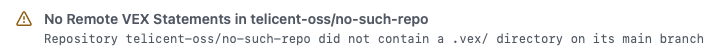

# Merge Vex Action

This repository provides a GitHub Action that handles the merging of one/more VEX statements, from both local and remote
repositories, into a single merged VEX file that can be conviniently passed into vulnerability scanners or other tools
that consume OpenVEX statements.

# Usage

At its most basic the action is used as follows:

```yaml
name: Merge VEX Example
on: 
  push:
  workflow_dispatch:

jobs:
  example:
    runs-on: ubuntu-latest
    permissions:
      contents: read

    steps:
      # Normal Job setup steps happen...
     
      # Merge VEX Statements
      - name: Merge VEX Statements
        uses: telicent-oss/merge-vex-action@v1
        with:
          name: example
          remote-vex: |
            telicent-oss/telicent-base-images

      # Further build steps that use the merged VEX file
```

This will attempt to create a merged VEX statements file, setting several [outputs](#outputs) indicating whether it has
done this, and where the merged file is located.  The merged file, if created, is also uploaded as a GitHub Actions
artifact so can be accessed by subsequent jobs in the same workflow if needed.

## GitHub Token Permissions

This action needs a GitHub Token in order to query the GitHub Releases API to discover the release binaries for
installing the necessary `vexctl` tools.  By default we take the default GitHub Token for the workflow from
the `github.token` context.  If you have restricted the `permissions` in your Workflow file then you **MAY** need to
provide a custom token rather than relying on the default.

If your build fails with the following error:

> You need at least read:packages scope to get a package's versions.

Then your token does not have correct permissions, either amend the `permissions` you are requesting for the token in
your workflow configuration, or use an Actions secret to provide a token for this purpose.

### Permissions for Remote VEX

Also, if you are using the [Remote VEX](#remote-vex-statements) feature then you **MUST** provide a token that has
permissions to read all the repositories you want to retrieve Remote VEX statements from otherwise some repositories
**MAY** be ignored, and you **MAY** not get the desired vulnerability suppressions you are expecting.

In this scenario the minimum permissions required for this feature to work correctly are `read:packages` and `repo`, and
for the `repo` permission it **MUST** pertain to all repositories you wish to access.  This means that the default
GitHub token permissions are generally **NOT** sufficient to use this feature.

If you provide a custom GitHub token then you **MUST** also customise the `gh-user` input to match the username of the
user who generated the GitHub token.

## VEX Sources

This action merges Vulnerability Exploitability Exchange (VEX) statements in OpenVEX JSON format.  OpenVEX statements
may be provided in two ways:

- Local statements from a `.vex/` directory in the working directory, typically this will be from the repository you
  have checked out in the workflow that calls this action.
- Remote statements from a `.vex/` directory in one/more remote repositories configured via the optional `remote-vex`
  input, see [Remote VEX Statements](#remote-vex-statements)

All discovered OpenVEX statements are merged together using the [`vexctl`][vexctl] tool to create a single VEX
statements file for the scan, this will be attached to the build as an artifact named `<name>-merged-vex-statements` so
it can be reviewed if needed.

### Remote VEX Statements

When the `remote-vex` input is given, it is a new line separated list of repository references in the form
`<owner>/<repo>`, optionally with an `@<branch>` suffix if the VEX statements are not on the `main` branch e.g. you use
a different default branch name.

For each remote repository reference the action will do a sparse git clone of the `.vex/` directory, copy those files
into a shared `.remote-vex/` directory, and then merge those with any local VEX statements.  The following example shows
this in action:

```yaml
name: Remote VEX Example
on: 
  push:
  workflow_dispatch:

jobs:
  example:
    runs-on: ubuntu-latest
    permissions:
      contents: read

    steps:
      # Normal Job setup steps happen...
     
      # Merge VEX Statements
      - name: Merge VEX Statements
        uses: telicent-oss/merge-vex-action@v1
        with:
          name: example
          remote-vex: |
            telicent-oss/telicent-base-images
            telicent-oss/smart-caches-core
          gh-user: ${{ secrets.REMOTE_VEX_USER }}
          gh-token: ${{ secrets.REMOTE_VEX_TOKEN }}
```

Here we are configuring the action to retrieve remote VEX statements from the `telicent-oss/telicent-base-images` and
`telicent-oss/smart-caches-core` repositories `main` branches.

Notice that for this to work we **MAY** need to set the `gh-user` and `gh-token` inputs to custom values, in this
example these reference some Action secrets that have been created.  The token passed in as the `gh-token` input
**MUST** have the ability to read the contents of the referenced repositories, it **MUST** also have the ability to read
packages from repositories as the `vexctl` command line tools needed are installed via querying the GitHub Releases API,
see [Token Permissions](#github-token-permissions) for more information on this.

Note that if any of the specified repositories does not exist, does not have the referenced branch, or no `.vex/`
directory exists on that branch then a build warning is issued e.g.



This warning is issued regardless of the reason for failure e.g. bad [Token Permissions](#github-token-permissions), no
`.vex/` directory in remote repository etc.

# Inputs

| Input | Required? | Default | Purpose |
|-------|-----------|---------|---------|
| `name` | Yes | N/A | A unique name (within the calling workflow) for this merge used to disambiguate the naming of the merged statement files. |
| `remote-vex` | No | `null` | If your scans involved building atop of libraries/base images provided in other repositories you can supply one/more references to repositories here from which VEX statements will be retrieved, see [VEX Support](#vex-support). |
| `gh-token` | No | `github.token` | Sets the GitHub token used to authenticate to GitHub to fetch `vexctl` release metadata, and to retrieve [Remote VEX](#permissions-for-remote-vex) statements. |

# Outputs

| Output | Description |
|--------|-------------|
| `prepared` | A boolean i.e. `true` or `false` indicating whether a merged VEX file was prepared.  Will be `false` if no local/remote VEX statements were found. |
| `vex-file` | Full path to the merged VEX file, this will be located under `RUNNER_TEMP` to avoid polluting your workspace directory.  This will only be set if `prepared` is `true`. |
| `vex-file-name` | Filename only of the merged VEX file.  This will only be set if `prepared` is `true`. |
| `vex-artifact` | Name of the GitHub Actions artifact that contains the merged VEX file.  This artifact will only exist if `prepared` is `true`.  |

# License

This Action is licensed under the Apache License 2.0, see [LICENSE](LICENSE) and [NOTICE](NOTICE) for more information.

[vexctl]: https://github.com/openvex/vexctl
